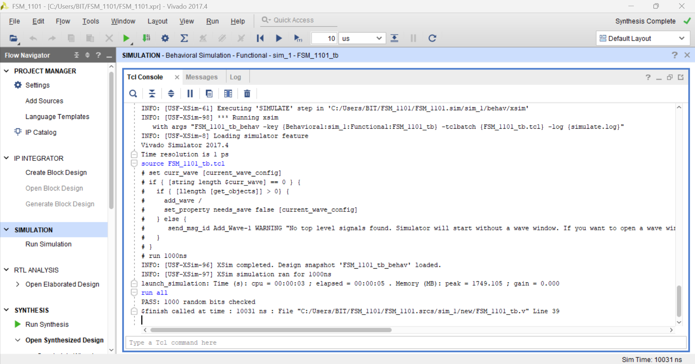
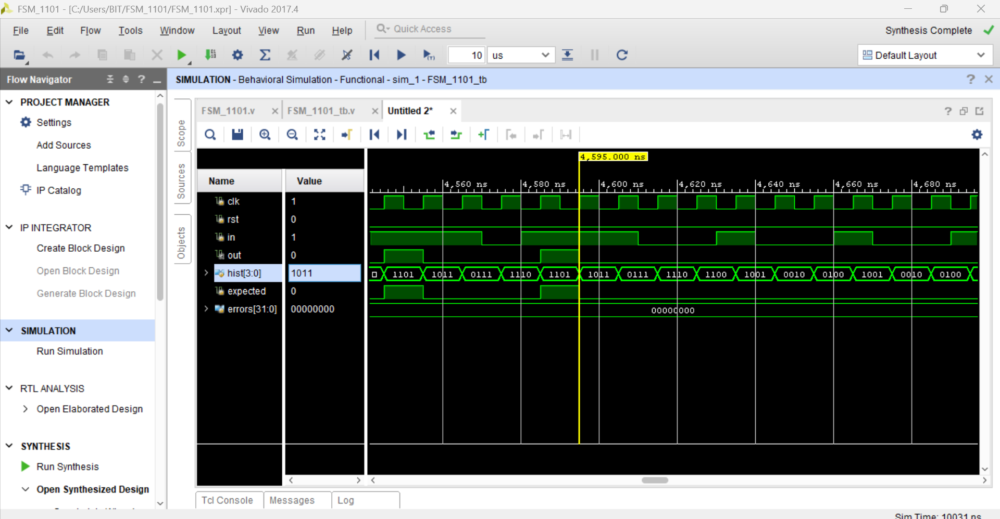
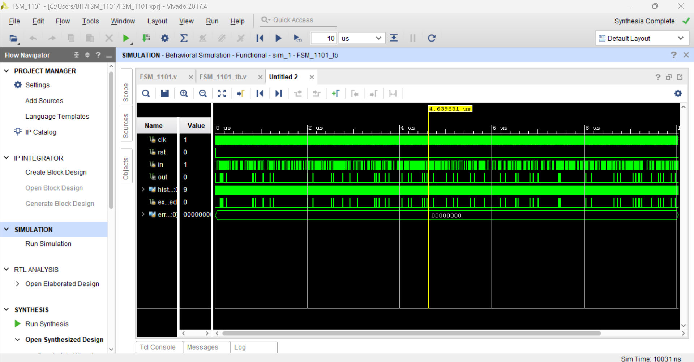
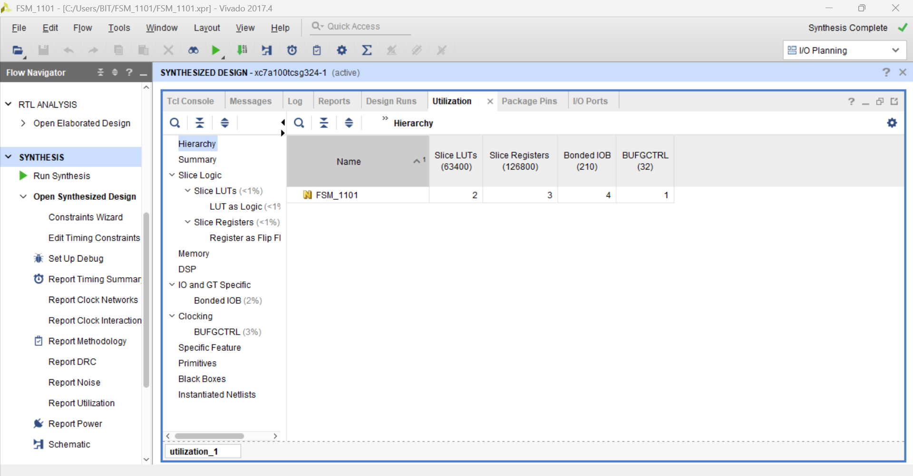
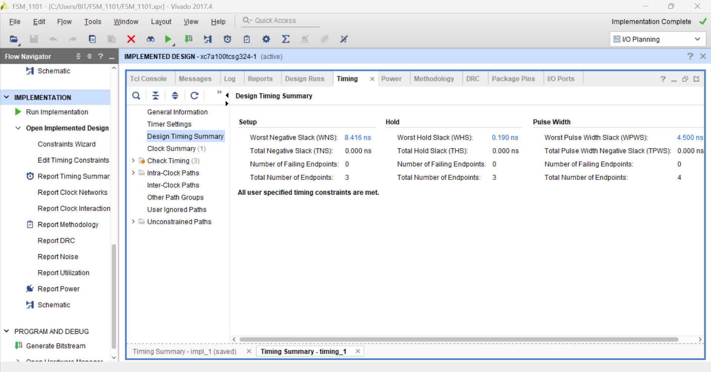

# 1101 Overlapping Sequence Detector (Verilog)

A finite state machine that detects the serial bit pattern **1101**, including
overlapping occurrences (e.g. 1101101 contains two matches). The output is
registered, so it goes high one clock cycle after the final bit arrives.

## Design
| State | Meaning |
|---|---|
| S0 | no useful bits seen yet |
| S1 | seen `1` |
| S11 | seen `11` |
| S110 | seen `110` |

In S110, if the input is 1, `out` is set high and the FSM moves to S1, because
that last 1 can begin a new pattern. This is what makes the detector overlapping.

## Files
- `src/FSM_1101.v`: FSM design
- `tb/FSM_1101_tb.v`: self-checking testbench
- `constraints/timing.xdc`: 100 MHz clock constraint

## Verification
The testbench drives 1000 random input bits and compares the FSM output with a
reference model (a 4-bit shift register of the last four inputs) on every cycle.
Inputs change on the falling clock edge to avoid races with the rising edge.

**Result: PASS, 0 mismatches over 1000 random cycles.**

## Synthesis and timing
Tool: Vivado 2017.4, target device xc7a100tcsg324-1 (Artix-7), 10 ns clock (100 MHz).

| Metric | Result |
|---|---|
| Slice LUTs | 2 |
| Slice registers | 3 |
| Worst negative slack (setup) | +8.416 ns |
| Worst hold slack | +0.190 ns |
| Failing endpoints | 0 |

All user-specified timing constraints are met.

## How to run
1. Create a Vivado RTL project and add `src/FSM_1101.v` as a design source.
2. Add `tb/FSM_1101_tb.v` as a simulation source and `constraints/timing.xdc` as a constraint.
3. Run Behavioral Simulation, then `run all` in the Tcl console.
4. Run Synthesis, then Implementation, then Report Timing Summary.

Note: simulation, synthesis and implementation only; not deployed on hardware.
